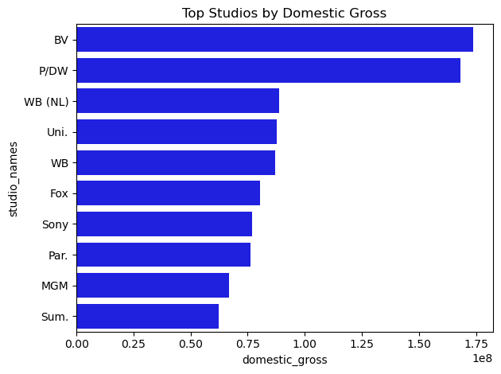
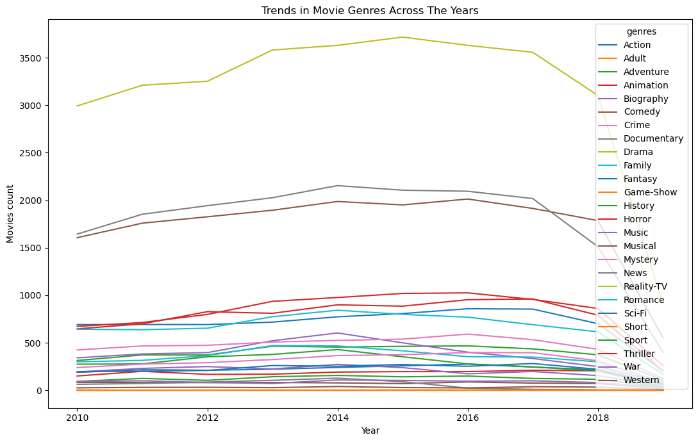
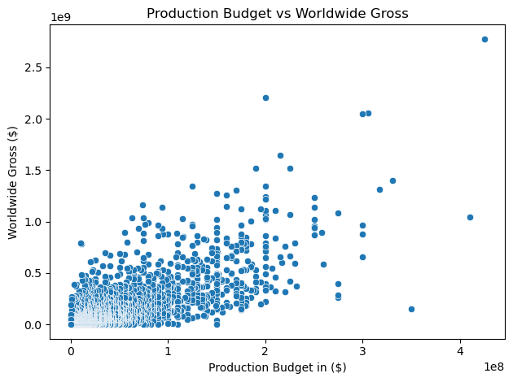
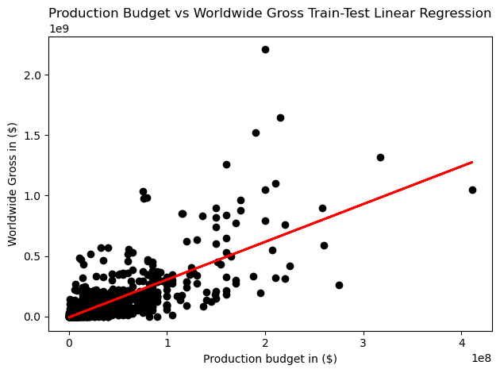

# FILMS ANALYSIS AT THE BOX OFFICE
***

## OVERVIEW
This project uses exploratory data analysis to generate insights in movie patterns. The goal is to identify the type of films that are currently performing best at the box office and with that, guide the company investment decisions as it starts its new movie studio. By cleaning, merging, grouping the data we understand what films are most appropriate and key factors behind their success.

## BUSINESS PROBLEM
The company is determined to launch a new movie studio though they lack experience in film production. The aim of this analysis is to analyze what type of films are currently doing best at the box office, then turn the findings into practical recommendations that helps the company to strategically position itself and successfully enter the film industry.

## DATA
This project uses movie datasets from multiple locations with different file formats i.e CSV, SQLite. The primary dataset being used are

1. im database which is located in SQLite Database, with movie_basics and movie_ratings as the more applicable tables.
movie_basics table contain the following columns;

* movie_id "unique movie id number"
* primary_title "movie title displayed for audience"
* original_title "movie title as the createrors intended it"
* start_year "year movie started"
* runtime_minutes "movie duration in minutes"
* genres "movie categories"
and the movie_ratings table contain;

* movie_id "unique movie id number"
* averagerating "IMDb user ratings"
* numvotes- "number of user votes per movie"
From the IMDB data we have "movie_id" column as the unique identification for movie_basics and movie_ratings tables

2. bom.movie_gross.csv.gz that is inform of a csv formart, it includes the following columns;
* title "representing the movie title"
* studio "representing the production studio"
* domestic_gross "total revenue generated by films locally"
* foreign_gross "total revenue generated by films internationaly"
* year "year of movie release"
  
3. tn.movie_budgets.csv.gz data which is inform of a csv fortmat contain the following columns;
* worldwide_gross "representing the total international revenue generated by a movie"
* domestic_gross "representing the total revenue generetated by a move locally"
* production_budget "representing the amount spent during movie production"
* movie "represnting the movie name"
* release_date "date the film was released"
* id " movie unique identifier"

## METHODS
This project uses descriptive statistics and inferential analysis to show insight in films performance at the box office.

## RESULTS
* I performed a statistical test to confirm if the average domestic gross differ between the studios. By creating a null hypothesis stating that
the means of domestic gross across the studios are the same and a contradicting alternative hypothesis stating, The means of domestic gross across the studios are not the same.
After performing the ANOVA Test we realised that indeed there is a strong statistical evidence that studios that produce a movie have an impact on how much money it earns in the domestic box office market.



* Analyzing the genres popularity between 2010 and 2018 I observed that Over the years Drama production dominated the film industry with over 3,000 films. Followed by Comedy and Documentary with more than 1500 films each.
  


* In terms of film production budget and worldwide gross income;
  


* There is a lot of film spread at the low-budget (Below 100 million dollars) compared to the high-budget (Above 100 million dollars).
At lower-budgets some films display high gross income while others don't. At higher-budgets, gross increases rapidly but still fluctuates in some cases.



* Judging by the slope of the regression line there is a positve relationship between film production budget and worldwide gross income, meaning
as the production budget increases, the worldwide gross income also tend to increase (bigger budget films result to higher gross income).
Few spread of films around the regression line suggest that some other factors apart from the production budget i.e genre type, movie runtime duratin also have an effect on the worldwide gross.

## CONCLUSIONS
* Analysis of the average domestic gross of films across different studios indicates a relationship between the studio producing the film and its local earnings. Showing that studio choice can significantly influence movie performance within the domestic market.

* Analysis of genre popularity from 2010 to 2018 shows that Drama was the most produced genre with over 3,000 films, followed by Comedy and Documentary with over 1500 films each.

* There is a postive relationship between movies production budget and worldwide gross income, meaning higher budget movies lead to higher foreign income. however, sometimes low budget movies display higher worldwide gross and high budget movies display lower worldwide gross this is as a result of effect of other factors i.e genre type, movie duration runtime on the worldwide gross.

## RECOMMENDATIONS
1. The company should study Bueno Vista's (a division of Disney studios) production strategy, as it outperformed other studios in domestic box office market.
2. The company should consider focusing on Drama, Comedy films as they've appeared to be popular genres being produced at the time, showing audience demand and potential success
3. While higher production budgets leads to higher worldwide gross income, the company should not only depend on high budgets for success but also should focus on producing well-crafted Drama or comedy films with balanced budgets

****

## Repository Structure
```
├── data
├── images
├── README.md
├── presentation.pdf
└── films_analysis.ipynb
```
